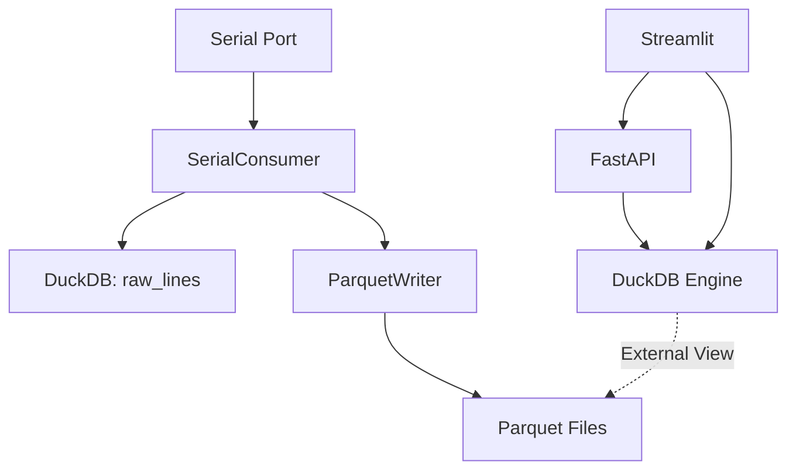

# DuckDB & DuckLake Integration

[🏠 Home](../README.md) > [Architecture](overview.md)

The DuckDB backend provides persistent storage for raw NMEA sentences and parsed structured data, now enhanced with Parquet-native DuckLake storage.

## Database Schema Architecture

### Raw Lines Table

Stores every received line with metadata before parsing:

```sql
CREATE TABLE raw_lines (
    line_id BIGSERIAL PRIMARY KEY,
    received_at TIMESTAMP DEFAULT current_timestamp,
    raw_sentence TEXT NOT NULL,
    parse_status VARCHAR(10) CHECK (parse_status IN ('OK', 'FAIL')),
    record_type VARCHAR(20),  -- PNORI, PNORS, etc., or 'ERROR'
    checksum_valid BOOLEAN,
    error_message TEXT
);

CREATE INDEX idx_raw_lines_received_at ON raw_lines(received_at);
CREATE INDEX idx_raw_lines_record_type ON raw_lines(record_type);
CREATE INDEX idx_raw_lines_parse_status ON raw_lines(parse_status);
```

### Record Type Tables

One table per NMEA message family, containing parsed structured data:

- `pnori_configurations` - Configuration sentences (PNORI, PNORI1, PNORI2)
- `pnors_sensor_data` - Sensor data (PNORS, PNORS1, PNORS2, PNORS3, PNORS4)
- `pnorc_current_velocity` - Current velocity (PNORC, PNORC1, PNORC2, PNORC3, PNORC4)
- `pnorh_header_data` - Header data (PNORH3, PNORH4)
- `pnora_altitude` - Altitude/range data
- `pnorw_wave_data` - Wave data
- `pnorb_bottom_tracking` - Bottom tracking data
- `pnore_echo_intensity` - Echo intensity data
- `pnorf_frequency_data` - Frequency data
- `pnorwd_wave_directional` - Wave directional data

Each table has format-specific columns with appropriate types and constraints.

### Error Table

Stores sentences that failed parsing:

```sql
CREATE TABLE parse_errors (
    error_id BIGSERIAL PRIMARY KEY,
    received_at TIMESTAMP DEFAULT current_timestamp,
    raw_sentence TEXT NOT NULL,
    error_type VARCHAR(50) NOT NULL,
    error_message TEXT,
    attempted_prefix VARCHAR(20),
    checksum_expected VARCHAR(2),
    checksum_actual VARCHAR(2)
);

CREATE INDEX idx_errors_received_at ON parse_errors(received_at);
CREATE INDEX idx_errors_type ON parse_errors(error_type);
```

## Data Flow

```
Serial Port
    │
    v
┌─────────────────┐
│  Raw Sentence   │
└────────┬────────┘
         │
         v
┌─────────────────────┐
│  Insert raw_lines   │
│  (parse_status=NULL)│
└────────┬────────────┘
         │
         v
    ┌────┴────┐
    │  Parse  │
    └────┬────┘
             ┌────────┴─────────┐
      │                  │
      v                  v
┌─────────┐      ┌────────────┐
│ DuckDB  │      │ Daily Files│
│ (Metadata/│    │  (*.dat)   │
│ Views)  │      └────────────┘
└─────────┘             │
     │                  v
     │           ┌────────────┐
     v           │ Parquet    │
┌─────────┐      │ (DuckLake) │
│Raw Lines│      │ Partitioned│
│Parsed   │      └────────────┘
│Errors   │             │
└─────────┘             v
               ┌────────────────┐
               │ Analysis Layer │
               │ - FastAPI      │
               │ - Streamlit    │
               └────────────────┘
  └──────────────┘
```

## Daily File Output

In addition to DuckDB storage, records are optionally written to daily files:

### File Naming Convention

```text
data_report/PNORI_2025_12_30.dat
data_report/PNORC_2025_12_30.dat
data_report/PNORS_2025_12_30.dat
...
data_report/PNORI1_YYYY_MM_DD.dat
data_report/PNORC1_YYYY_MM_DD.dat
data_report/PNORS1_YYYY_MM_DD.dat
data_report/PNORI2_YYYY_MM_DD.dat
data_report/PNORC2_YYYY_MM_DD.dat
data_report/PNORS2_YYYY_MM_DD.dat
data_report/PNORC3_YYYY_MM_DD.dat
data_report/PNORC4_YYYY_MM_DD.dat
```

### File Format

Plain text, one NMEA sentence per line:

```text
$PNORI,4,Signature1000900001,4,20,0.20,1.00,0*2E
$PNORI,4,Signature1000900001,4,20,0.20,1.00,0*2E
```

### Rotation Strategy

- **Daily rotation**: New file created at midnight UTC (configurable timezone)
- **Append mode**: Safe for inter-process access
- **No locking required**: Append-only writes are atomic on most filesystems

## Connection Management

### Initialization

```python
import duckdb

def configure_duckdb(db_path='./data/adcp_recorder.db'):
    conn = duckdb.connect(db_path)
    
    # Configure for write-heavy workload
    conn.execute("SET wal_autocheckpoint='1GB'")
    conn.execute("SET checkpoint_threshold='1GB'")
    
    # Create tables if not exist
    conn.execute(create_raw_lines_table_sql)
    conn.execute(create_parse_errors_table_sql)
    # ... create all record type tables
    
    return conn
```

### Connection Pooling

For multi-threaded access:

```python
from threading import local

thread_local = local()

def get_connection():
    if not hasattr(thread_local, 'conn'):
        thread_local.conn = duckdb.connect('./data/adcp_recorder.db')
    return thread_local.conn
```

## Batch Insert Pattern

Accumulate parsed records and insert in batches for performance:

```python
batch_size = 100
batch = []

for sentence in sentences:
    parsed = parse_sentence(sentence)
    batch.append(parsed.to_duckdb_dict())
    
    if len(batch) >= batch_size:
        conn.executemany(insert_sql, batch)
        batch.clear()

# Flush remaining
if batch:
    conn.executemany(insert_sql, batch)
```

## Transaction Management

### Write Transactions

```python
conn.begin()
try:
    # Insert into raw_lines
    conn.execute(insert_raw_line_sql, raw_data)
    
    # Insert into record table
    conn.execute(insert_record_sql, parsed_data)
    
    conn.commit()
except Exception as e:
    conn.rollback()
    log_error(f"Transaction failed: {e}")
```

### Read-Only Queries

```python
# No explicit transaction needed
results = conn.execute("""
    SELECT record_type, COUNT(*) as count
    FROM raw_lines
    WHERE parse_status = 'OK'
    GROUP BY record_type
""").fetchall()
```

## Maintenance Procedures

### Vacuum and Optimize

```sql
-- Run periodically to reclaim space
CHECKPOINT;
VACUUM;
ANALYZE;
```

### Partition Management

For large datasets, consider partitioning by date:

```sql
-- Example: Monthly partitions
CREATE TABLE raw_lines_2025_01 AS
SELECT * FROM raw_lines
WHERE received_at >= '2025-01-01' AND received_at < '2025-02-01';

-- Create index on partition
CREATE INDEX idx_raw_lines_2025_01_received_at 
ON raw_lines_2025_01(received_at);
```

### Backup Strategy

```bash
# Backup database file
cp ./data/adcp_recorder.db ./backups/adcp_recorder_$(date +%Y%m%d).db

# Export to Parquet for long-term archival
duckdb ./data/adcp_recorder.db -c "COPY raw_lines TO 'archive/raw_lines.parquet'"
```

## DuckLake: Multi-Layer Storage

Starting with version 0.1.3, ADCP Recorder adopts a "DuckLake" architecture. This combines the transactional reliability of DuckDB for metadata and active logging with the scalability and compression of Parquet for long-term structured data.

### Hybrid Data Strategy

1. **DuckDB (Transactional)**:
    - Stores `raw_lines` for every incoming sentence.
    - Stores `parse_errors` for immediate troubleshooting.
    - Serves as the query engine (linking to Parquet via Views).
2. **Parquet (Analytical)**:
    - Stores parsed structured records (Current velocity, Sensor data, etc.).
    - Partitioned by record type and date: `data/parquet/{record_type}/date={YYYY-MM-DD}/`.
    - Highly compressed and optimal for large-scale analysis.

### Parquet Storage Structure

The `ParquetWriter` component buffers records and writes them to a partitioned directory structure:

```
data/
└── parquet/
    ├── pnors/
    │   └── date=2026-01-15/
    │       └── pnors_1705352400.parquet
    ├── pnorc/
    │   └── date=2026-01-15/
    │       └── pnorc_1705352400.parquet
    └── ...
```

### DuckLake Views

The `DatabaseManager` automatically discovers Parquet files and creates virtual views for seamless SQL access:

```sql
-- View created automatically on startup
CREATE OR REPLACE VIEW view_pnors AS 
SELECT * FROM read_parquet('data/parquet/pnors/**/*.parquet');

-- You can query it like a normal table
SELECT AVG(temperature), recorded_at 
FROM view_pnors 
WHERE recorded_at > '2026-01-15 00:00:00'
GROUP BY 2;
```

### Data Flow (Revised)



## Performance Tuning

### Write Performance

- Use batch inserts (100-1000 rows per batch)
- Disable autocommit and use manual transactions
- Create indexes after bulk imports
- Increase checkpoint threshold for write-heavy workloads

### Read Performance

- Create indexes on frequently queried columns
- Use materialized views for complex aggregations
- Enable parallel query execution
- Use columnar storage for analytical queries

### Memory Configuration

```sql
SET memory_limit='4GB';
SET threads=4;
SET temp_directory='/fast/ssd/tmp';
```

## Related Documents

- [System Overview](overview.md)
- [Serial Processing](serial-processing.md)
- [DuckDB Schema Patterns](../implementation/duckdb/schemas.md)
- [DuckDB Constraints](../implementation/duckdb/constraints.md)

---

[⬆️ Back to Architecture](overview.md) | [🏠 Home](../README.md)
